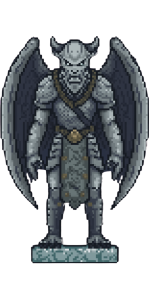
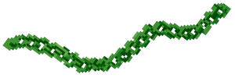
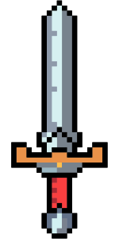

<!-- TOP FLOATING CLOUDS DECORATION -->

  

<!-- MAIN BANNER FLANKED BY TORCH AND GARGOYLE -->

  
  
  

 

<!-- PLAYER HUD: ENERGY & MANA BARS -->

  
  
  &nbsp;&nbsp;
  
  

 

<!-- CLICKABLE MENU BUTTONS -->

  
  
  

 

<!-- MAIN UI DIVIDER -->

  

<!-- SECTION 1: EQUIPPED SKILLS -->

  

 

  <table border="0">
    <tr>
      <td align="center" width="33%">
         
        <b>C LANGUAGE</b>
      </td>
      <td align="center" width="33%">
         
        <b>QUEST ITEM</b>
      </td>
      <td align="center" width="33%">
         
        <b>DUNGEON BOSS</b>
      </td>
    </tr>
  </table>

 

<!-- MOSS CHAIN DIVIDER -->

  

 

<!-- SECTION 2: ACTIVE QUESTS -->

  

 

  
  &nbsp;&nbsp;&nbsp;&nbsp;
  
  &nbsp;&nbsp;&nbsp;&nbsp;
  

 

  

<!-- SECTION 3: STUDENT STATS -->

  

 

  
  
<i>Tracking progress, assignments, and dungeon levels.</i>

 

  

<!-- SECTION 4: GUILD CONTACT -->

  

 

  

