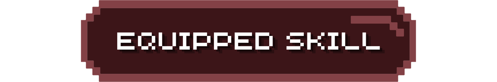
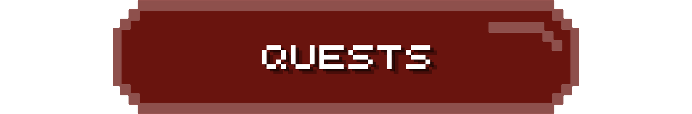
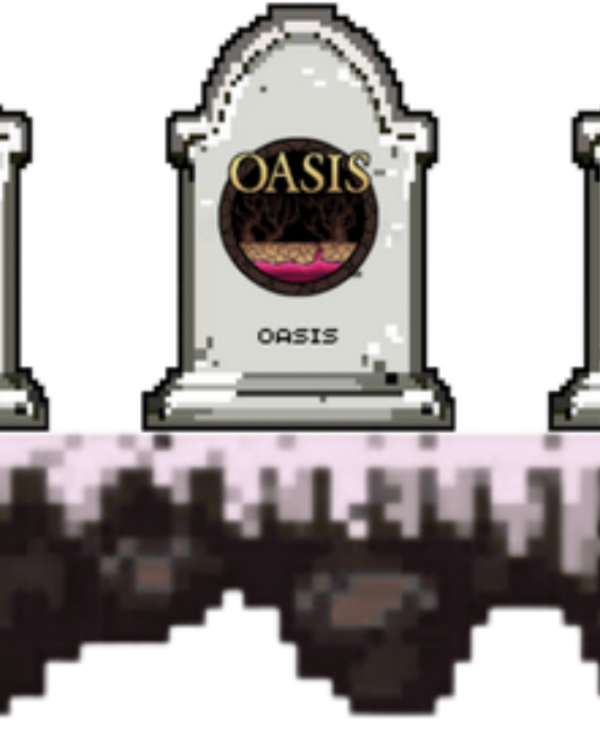
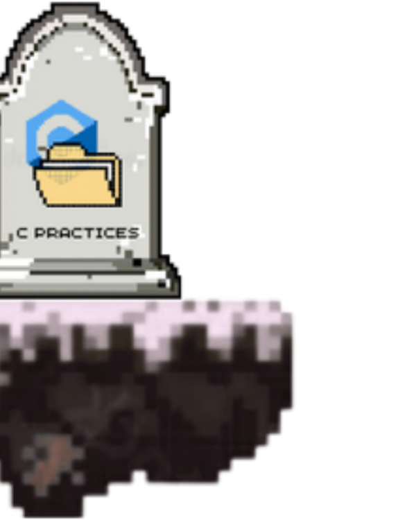
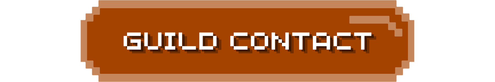
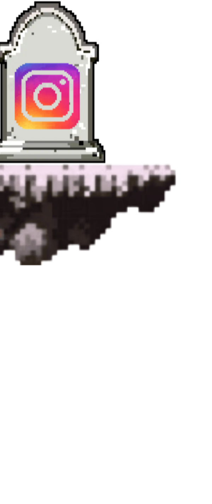

<!-- 1. HEADER TITLE SCENE (GIF) -->

  

 

<!-- 2. EQUIPPED SKILL BANNER (PNG) -->

  

 

<!-- 3. C LANGUAGE TOMBSTONE (GIF) -->

  

 

<!-- 4. QUESTS BANNER (PNG) -->

  

 

<!-- 5. 3 QUEST TOMBSTONES (GIF, PNG, PNG) -->

  

 

<!-- 6. GUILD CONTACT BANNER (PNG) -->

  

 

<!-- 7. 3 SOCIAL TOMBSTONES (PNG, GIF, PNG) -->

  

