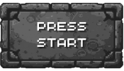
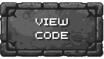
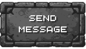
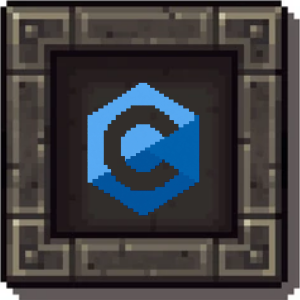

<!-- MAIN HEADER BANNER (GIF for movement) -->

  

 

<!-- HUD STATUS BARS (GIF for animated bars/hearts) -->

  
  &nbsp;&nbsp;
  

 

<!-- MENU BUTTONS (Static SVG or Animated GIF) -->

  
  
  

 

<!-- DIVIDER -->

  

 

<!-- EQUIPPED SKILLS SECTION -->

  

 

  

 

<!-- DIVIDER -->

  

 

<!-- ACTIVE QUESTS SECTION -->

  

 

  

 

<!-- DIVIDER -->

  

 

<!-- GUILD CONTACT SECTION -->

  

 

  

